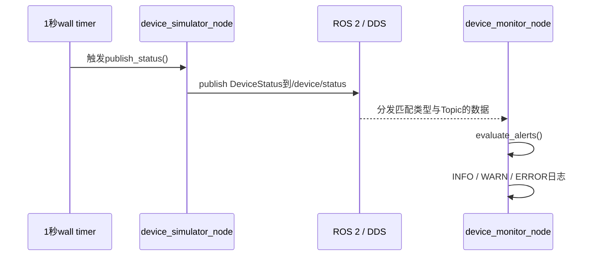

# 系统架构

## V0边界

V0是两个本地进程组成的最小ROS 2系统：

```text
device_simulator_node
  └─ publishes robot_device_interfaces/msg/DeviceStatus
       on /device/status
         └─ device_monitor_node subscribes
```

终端1在Ubuntu 22.04/Humble内运行完整系统，终端2在Ubuntu 26.04/Lyrical内运行另一套
完整系统。GitHub同步源码，两个ROS图之间不通信。

## Package、executable、进程与node

这些概念不是同一层级：

```text
ROS workspace
└── package
    ├── 源码、消息、CMake和package.xml
    └── executable（编译产物）
        └── process（操作系统运行实例）
            └── node（加入ROS图的逻辑参与者）
```

`robot_device_interfaces`只产生消息类型，不产生进程。`device_simulator`和
`device_monitor`各产生一个executable。

V0主动保持下面的1:1关系：

```text
一个业务package → 一个executable → 一个进程 → 一个node
```

这样最接近传统的“一个车载应用一个进程”。ROS 2也支持一个package包含多个
executable，或者一个进程组合多个node，但V0不使用这些能力。

## Topic数据流



发布者只声明“我向这个Topic发布这种消息”，不持有监控节点的地址。订阅者只声明
“我对这个Topic和类型感兴趣”。DDS负责发现匹配端点、序列化、传输和QoS执行。

## 为什么不需要中央消息转发节点

传统中央RPC代理或消息Broker通常是一个明确的独立服务：

```text
应用A → 中央代理进程 → 应用B
```

应用需要知道代理地址，代理故障会直接影响所有经过它的请求。RPC还通常包含明确的
请求方、服务方以及请求/响应生命周期。

本项目使用ROS 2 Topic：

```text
发布节点 → DDS数据分发 → 一个或多个订阅节点
```

默认DDS发现和数据交换不要求项目再编写一个中央转发node。ROS 2的RMW层把具体DDS
实现隐藏在统一API下。某些网络或大规模部署可以选择DDS Discovery Server等基础设施，
但那不是V0的组成部分，也不等同于业务消息转发节点。

因此，如果额外增加一个“中央消息转发node”，它只会重复DDS已经承担的工作，同时增加
新的延迟、依赖和故障点。

## 消息package为何独立

`DeviceStatus`是生产者和消费者之间的契约。独立package使依赖方向保持清楚：

```text
device_simulator ─┐
                  ├─→ robot_device_interfaces
device_monitor ───┘
```

模拟器和监控器互不依赖。接口发生变化时，两个消费者都需要重新生成类型并重新构建，
CI也能通过package依赖图发现影响范围。

## 参数与运行配置

模拟器的四个启动参数是：

| 参数 | 类型 | 默认值 | 说明 |
|---|---|---|---|
| `device_id` | string | `robot-001` | 设备逻辑编号 |
| `initial_battery_level` | double | `100.0` | 初始电量，启动时限制到0～100 |
| `software_version` | string | `1.0.0` | 软件版本 |
| `publish_period_ms` | int64 | `1000` | 发布周期，必须大于0 |

ROS参数的浮点类型是float64，因此`initial_battery_level`在参数层使用C++ `double`，写入
消息时显式转换为`float32`。

Launch文件位于`device_simulator`，因为V0被限定为恰好三个package，而且该Launch描述
的是模拟场景。系统扩大后，应增加独立的bringup/config package来承载整机启动配置。

## 告警逻辑边界

订阅回调只做三件事：

1. 读取消息并输出INFO；
2. 把电量和温度传给纯C++ `evaluate_alerts()`；
3. 将返回结果映射为WARN或ERROR。

纯逻辑不依赖`rclcpp`，所以可以在不启动ROS图的情况下测试严格边界：

- `battery_level < 20.0`为低电量；
- `battery_level == 20.0`不是低电量；
- `temperature > 70.0`为高温；
- `temperature == 70.0`不是高温。

单元测试证明判断规则，冒烟测试才证明Topic回调和真实ROS日志级别。

## 未来扩展方向

以下内容只是架构演进方向，V0尚未实现：

```mermaid
flowchart LR
    HW[真实MCU/传感器]
    GW[硬件通信网关node<br/>未来]
    STATUS[//device/status]
    MON[监控node<br/>V0]
    DIAG[诊断/OTA协调node<br/>未来]
    REC[数据记录node<br/>未来]
    CLOUD[身份校验/数据回传node<br/>未来]

    HW <-- 私有硬件协议 --> GW
    GW --> STATUS
    STATUS --> MON
    STATUS -.-> DIAG
    STATUS -.-> REC
    STATUS -.-> CLOUD
```

### 硬件通信网关node

未来用它替换模拟器的数据来源。网关负责串口、CAN、以太网或厂商协议适配，并向ROS图
发布稳定的公共消息。私有硬件协议不应泄漏到所有业务节点。

### 诊断与OTA节点

未来可以订阅设备状态并管理诊断或升级流程。V0没有实现Service、Action、升级状态机、
镜像校验或回滚，因此目前不能声称具备OTA能力。

### 数据记录node

未来可根据状态和告警决定是否记录数据。V0没有数据库、rosbag集成或落盘策略。

### 身份校验和数据回传node

未来可隔离凭证、设备身份和上行网络逻辑。真实密钥与证书永远不进入源码仓库。

随着系统增长，应优先增加新node并复用消息契约，而不是让现有node不断累积不相关职责。
